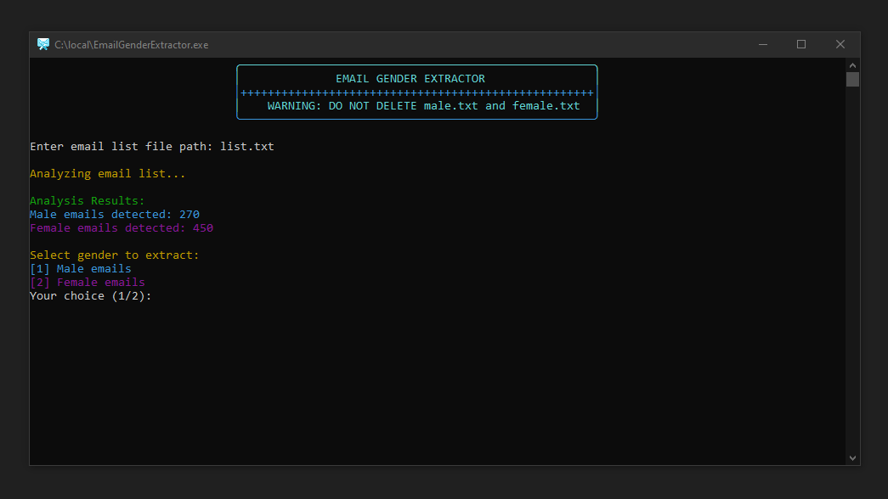

# Email Gender Extractor 📧🔍

## Screenshot

--
`EmailGenderExtractor.exe` is a simple tool that helps you analyze and extract gender-specific email addresses from a given list of emails. It uses predefined male and female name lists to classify the emails and can save the extracted emails to separate output files.

## Features ✨

- **Analyze email list**: Detects male and female emails based on the names before the '@' symbol. 👦👧
- **Extract and save emails**: Save extracted male or female emails to separate text files. 📤
- **Easy to use**: Run as a standalone `.exe` file with simple command-line prompts. 💻
- **Color-coded output**: Colored output for better user experience. 

## Requirements 🛠️

- **Windows OS**: Since this is compiled as a Windows executable, it requires a Windows operating system. 🖥️
- **Predefined name lists**: Ensure you have the `male.txt` and `female.txt` files containing lists of male and female names, respectively. 📄

## Files Required 📂

- **male.txt**: A text file containing a list of male names (one name per line). 👨
- **female.txt**: A text file containing a list of female names (one name per line). 👩
- **your_maillist.txt**: A text file containing the list of email addresses you want to analyze. 📧

## Usage 🚀

1. **Place the `.exe` file** and the required text files (`male.txt`, `female.txt`, and `your_maillist.txt`) in the same directory. 📁
2. **Run `EmailGenderExtractor.exe`** by double-clicking the executable file. 🖱️
3. Follow the on-screen prompts to:
   - Enter txt file of email list. 📂
   - Choose to extract male or female emails. 👦👧
4. The tool will display the analysis results and save the extracted emails into separate files:
   - `extracted_male_emails.txt` 👨
   - `extracted_female_emails.txt` 👩

## Notes ⚠️

- **Do not delete `male.txt` and `female.txt`** as these files are essential for gender classification. OR `EmailGenderExtractor.exe` WILL NOT RUN ❌
- Ensure that the `your_maillist.txt` file is formatted correctly with one email per line. 📝

